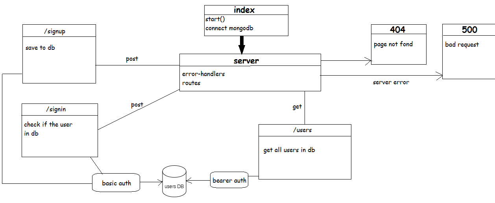

# LAB: Bearer Authorization

Author: anwar shraideh

# Setup

1- Clone the repository 

2- Run the command npm i express dotenv morgan base-64 bcrypt cors mongoose jsonwebtoken jest @code-fellows/supergoose to install dependencies

3- create .env file with PORT variable and MONGODB_URI_2 and SECRET

4-Run the command npm test to test and verify the server and the midddlewares are working.

# UML Diagram

